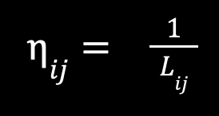

### Муравьиный алгоритм. Решение задачи коммивояжера. 

В данной статье я бы хотел объяснить работу алгоритма муравьиного алгоритма и решить с его помощью задачу коммивояжера. Решение задачи сводиться к выходу из какой-либо вершины графа, прохождению по всем вершинам по одному разу самым коротким путем и возврату к начальной точке. В конце статьи вас ожидает реализация алгоритма на языке Go.

### Метод перебора

Самый простой способ решить эту задачу можно методом перебора. Только данный способ подходит при малом количестве вершин. С увеличиением роста вершин вычислительная сложность увеличивается многократно и в какой-то момент нам просто их не хватит, чтобы решить задачу данным способом.

### Принципы работы муравьиного алгоритма

Когда муравей бежит к цели он руководствуется двумя параметрами: дальностью и количеством феромона отложенным предыдущим поколением муравьев. Чем ближе находиться ближайшая точка и чем больше феромона отложено на дороге, тем с большей вероятностью он пойдет по этой тропе. Мы используем вероятностный подход.


Р - вероятность выбора из пути из текущей вершины i в следующую вершину j.  
n - параметр обратный расстоянию между городами из текущей вершины i в следующую вершину j. (см. следующую формулу)  
t - количество феромона из текущей вершины i в следующую вершину j.  
b - параметр, которые позволяют отрегулировать алгоритм по расстоянию.  Чем больше значение, тем большее будет влияние количества феромона на выбор направления, при b = 0.0 вообще не будет учитываться.  
a - параметр, которые позволяют отрегулировать алгоритм по количеству  феромона. Чем больше значение, тем большее будет влияние расстояния на выбор направления, при a = 0.0 вообще не будет учитываться.  
Σ (n ^ b + t ^ a) - сумма всех расстояний и феромонов непосещенных вершин из текущей вершины i в следующую вершину j.



### Объяснение алгоритма

Основная функция `SolveTravelingSalesmanProblem`. В ней происходит вызов вспомогательных функций, она возвращает нам лучший путь, его посещенные вершины и длину маршрута.

#### Основной цикл 
В нем мы просто запускаем 100 итераций нашего алгоритма, чтобы за это время подобрать лучшее решение. С каждой итерацией мы подбираем наилучший путь.

#### Цикл по колонии муравьев 
В нем мы запускаем по одному муравью с каждой вершины графа. Это позволяет нам равномерно распределить феромон по всему пути и увеличить разнообразие решений. Если мы будем запускать муравьев постоянно с одной и той же вершины, мы будем усиливать одни и те же пути.

#### Цикл пострения пути
В нем мы отслеживаем путь определенного муравья по всему маршруту, пока не будут посещены все вершины со стартом и финишем в исходной точке. Каждый муравей выбирает следующую вершину на основе вероятности (см. формулу для нахождения Р).

#### Обновление феромонов (`updateDistanceMatrix`)
После прохождения муравьем по своему пути мы обновляем феромон на пройденных ребрах, тем самым усиливая короткий путь. Стоит отметить, что чем больше муравьев пройдет по данному пути, тем больше феромона будет на нем. Запускается после прохождения каждого муравья.

#### Испарение феромонов (`evaporatePheromones`)
Уменьшаем количество феромонов на всех ребрах. Тем самым мы снижаем усиление одного пути и даем возможность быть найденым другим путям. Запускается после прохождения всей колонии муравьев.

#### Добавление новых следов (`addNewTrails`)
Добавление феромона на основе пройденного пути снижает застой в решении и помогает найти новые пути. Запускается после прохождения всей колонии муравьев. Усиливаем текущий путь, чтобы следующая колония учитывала его.

### Описание работы алгоритма

<details>
<summary>Структура Graph </summary>

```
// Graph представляет граф с матрицей смежности
type Graph struct {
	adjacencyMatrix [][]int
}
```

```
// NewGraph создает новый граф
func NewGraph(vertexCount int) *Graph {
	matrix := make([][]int, vertexCount)
	for i := range matrix {
		matrix[i] = make([]int, vertexCount)
	}
	return &Graph{adjacencyMatrix: matrix}
}
```

```
// AddEdge добавляет ребро в граф
func (g *Graph) AddEdge(from, to, weight int) {
	if from < 0 || from >= len(g.adjacencyMatrix) || to < 0 || to >= len(g.adjacencyMatrix[from]) {
		// Индексы вне диапазона, ничего не делаем
		return
	}
	g.adjacencyMatrix[from][to] = weight
}
```

</details>
<br>


<details>
<summary>Константы</summary>

```
const (
	alpha = 9.0 // регулировка алгоритма по расстоянию (чем больше значение, тем большее будет влияние расстояния на выбор направления, при alpha = 0.0 вообще не будет учитываться)
	beta  = 5.0 // регулировка алгоритма по количеству феромона (чем больше значение, тем большее будет влияние количества феромона на выбор направления, при beta = 0.0 вообще не будет учитываться)
	p     = 0.7 // скорость испарения феромона
)
```

</details>
<br>

<details>
<summary>Основная функция</summary>

```
// SolveTravelingSalesmanProblem решает задачу коммивояжера с использованием муравьиного алгоритма
func SolveTravelingSalesmanProblem(graph *graph.Graph) TsmResult {
	distanceMatrix := graph.GetAdjacencyMatrix()
	n = len(distanceMatrix)
	Q = 5 * float64(n)
	// Координаты вершин
	pheromones := initPheromones()           // Wt След
	deltaPheromones := initDeltaPheromones() // DWt Матрица приращений следа

	Lmin := math.MaxFloat64      // начальное значение длины - infinity
	bestPath := make([]int, n+1) // n+1 для возврата в исходную точку

	for k := 0; k < 100; k++ { // Основной цикл
		for ant := 0; ant < n; ant++ { // Цикл по муравьям
			visited := make([]bool, n) // Список непосещенных вершин
			currentCity := ant         // Начальная вершина для муравья ant
			visited[currentCity] = true
			path := []int{currentCity} // Начало пути

			for len(path) < n { // Цикл пострения пути
				probabilities := calculateProbabilities(pheromones, distanceMatrix, currentCity, visited) // Каждой вершине - свой вес
				nextCity := selectNextCity(probabilities)                                                 // Выбор направления
				visited[nextCity] = true                                                                  // Tabu list увеличился
				path = append(path, nextCity)
				currentCity = nextCity // Начало дуги = конец предыдущей
			}
			path = append(path, path[0]) // Конец пути (возвращаемся в исходную точку)

			// проходимся по всему пути и суммируем длины
			L := calculatePathLength(path, distanceMatrix)

			// Проверка минимальной длины пути
			if L < Lmin {
				Lmin = L
				copy(bestPath, path)
			}

			// Пометка дуг феромоном
			updateDistanceMatrix(deltaPheromones, path, L)
		}

		evaporatePheromones(pheromones, p)           // Испарение феромонов
		addNewTrails(pheromones, deltaPheromones, p) // Добавление новых следов
	}

	return TsmResult{
		Vertices: bestPath,
		Distance: Lmin,
	}
}
```

</details>
<br>


<details>
<summary>Обновление феромона</summary>

```
// updateDistanceMatrix помечает дуги феромоном
func updateDistanceMatrix(deltaPheromones [][]float64, path []int, L float64) {
	for i := 0; i < len(path)-1; i++ {
		from := path[i]
		to := path[i+1]
		deltaPheromones[from][to] += Q / L
	}
}
```

</details>
<br>

<details>
<summary>Испарение феромона</summary>

```
// Испарение феромона
func evaporatePheromones(pheromones [][]float64, p float64) {
	for i := range pheromones {
		for j := range pheromones[i] {
			pheromones[i][j] *= (1 - p)
		}
	}
}
```

</details>
<br>

<details>
<summary>Добавление новых следов</summary>

```
// Добавление новых следов
func addNewTrails(pheromones, deltaPheromones [][]float64, p float64) {
	for i := range pheromones {
		for j := range pheromones[i] {
			pheromones[i][j] += deltaPheromones[i][j] * p
		}
	}
}
```

</details>

### Полезные материалы

- **Лекция на YouTube от Михаила Кирсанова** — [Муравьиный алгоритм](https://youtu.be/EwDP_bAb-OI?si=v0XYb4CUkZXG-iwM)
- **Книга от Михаила Кирсанова** — [Графы в Maple](https://eqworld.ipmnet.ru/ru/library/books/Kirsanov2007ru.pdf). Алгоритм из этой книги был взят за основу моей реализации.
- **Статья от Сергея Штовба в журнале Exponenta Pro** — [Муравьиные алгоритмы](https://www.researchgate.net/publication/280064579_Muravinye_algoritmy)

### Заключение

Муравьиный алгоритм является эффективным методом для решения задачи коммивояжера, особенно когда количество вершин велико и метод перебора становится непрактичным. Используя вероятностный подход и механизм феромонов, алгоритм позволяет находить приближенные решения, которые могут быть очень близки к оптимальным.

Полное и подробное описание работы алгоритма можно найти в моем [GitHub](https://github.com/alivewel/graph-algorithms).